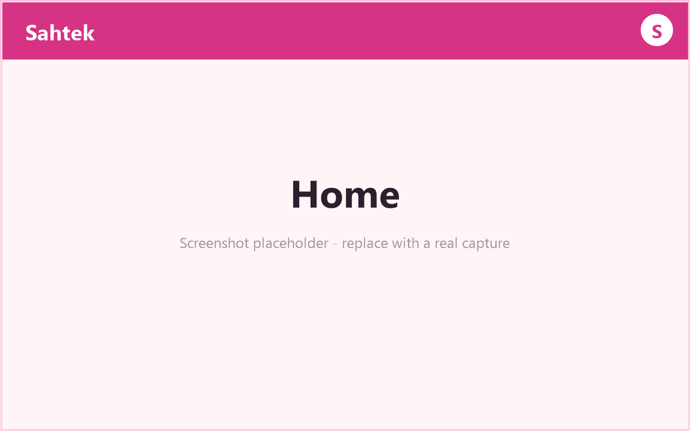
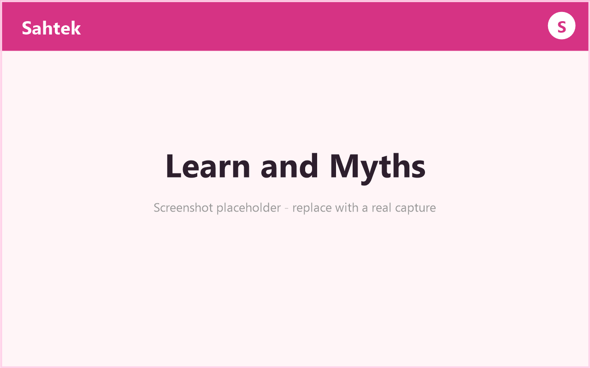
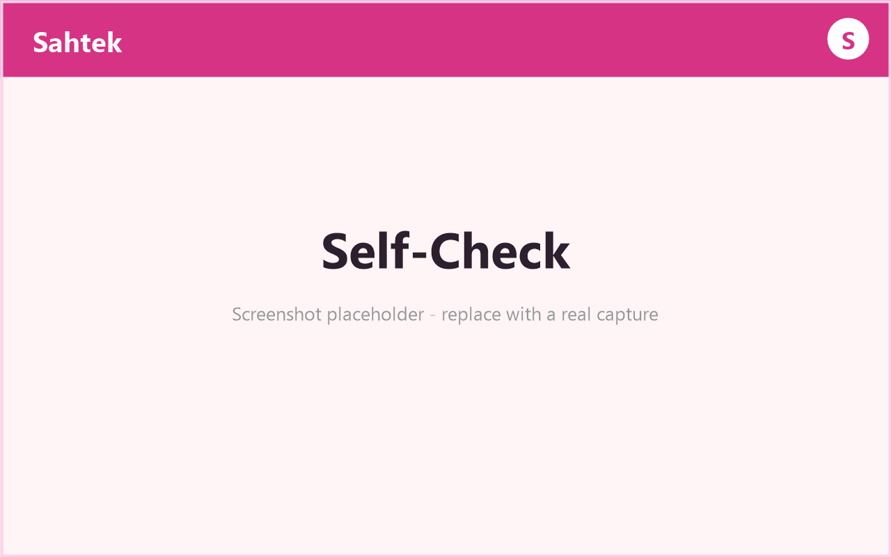
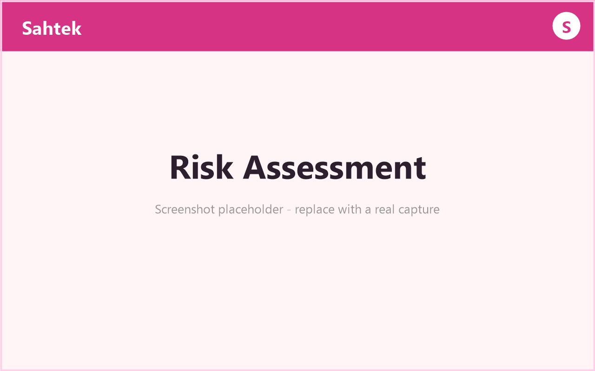
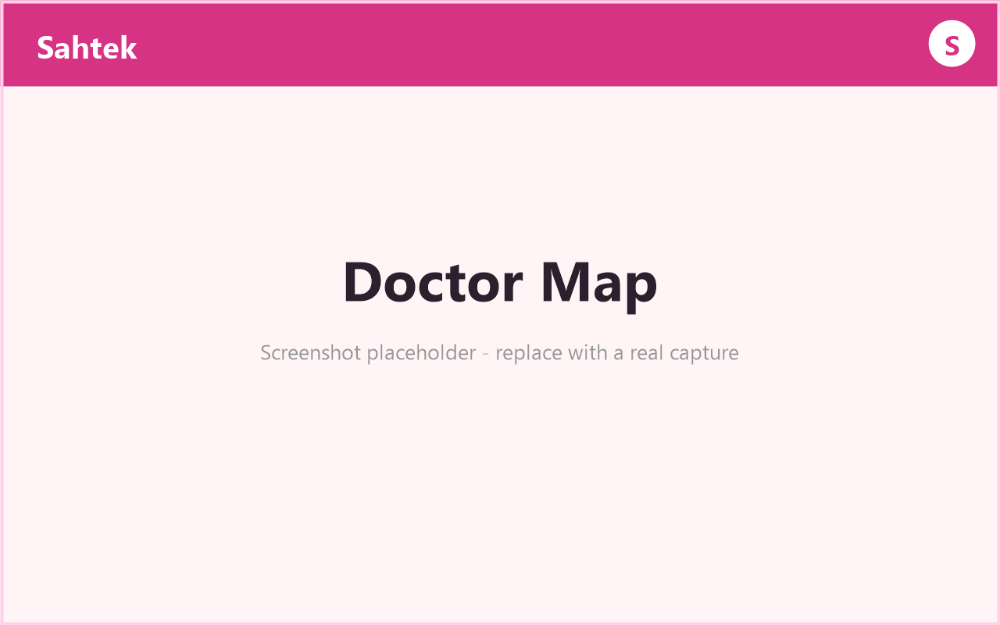
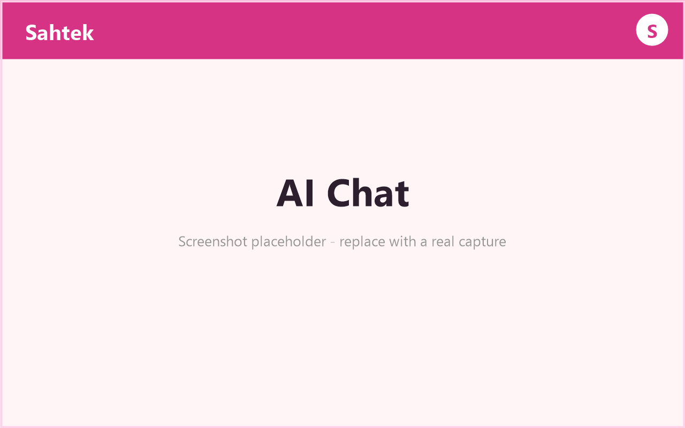
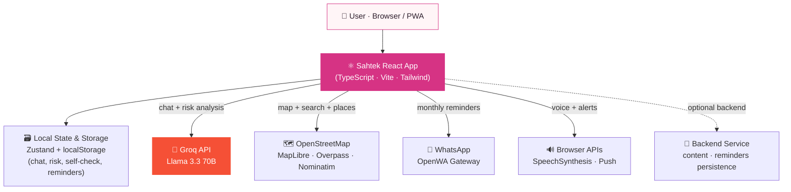

<div align="center">

# 🎀 صحّتك · Sahtek

### *"Your Health"* — in Moroccan Darija

**An AI-powered breast cancer self-check & awareness platform, built for Moroccan women.**

Early detection saves lives. Sahtek makes it accessible, private, and culturally at home — in the language women actually speak.

<br/>

[](https://sahtek.tech)
&nbsp;
[](https://sahtek.tech)

<br/>


<br/>

**[🚀 Live Demo](https://sahtek.tech)** · **[🐛 Report Bug](../../issues)** · **[✨ Request Feature](../../issues)**

<br/>

*Built with 💗 for the **Vibe Coding Hackathon 2026** — Polydisciplinary Faculty of Khouribga (FPK)*

</div>

---

## 📑 Table of Contents

- [About the Project](#-about-the-project)
- [Key Features](#-key-features)
- [Tech Stack](#-tech-stack)
- [Screenshots](#-screenshots)
- [Architecture](#-architecture)
- [Getting Started](#-getting-started)
- [What Makes Sahtek Different](#-what-makes-sahtek-different)
- [Roadmap](#-roadmap)
- [Team](#-team)
- [Acknowledgments](#-acknowledgments)
- [License](#-license)

---

## 💡 About the Project

### The Problem

Breast cancer is the **most common cancer among women in Morocco** — yet awareness and early detection remain critically low.

| 📊 The reality in Morocco | |
|---|---|
| 🔴 **~12,000** new cases every year | The leading cancer diagnosis in women |
| 🔴 **~60%** diagnosed **late** | When treatment is harder and survival drops |
| 🟢 **Up to 99%** survival | *when* caught early — detection is everything |
| ⚕️ Average diagnosis age **~48** | Younger than in many countries |

The gap isn't medicine — it's **awareness, access, and comfort**. Many women lack information in their own language, feel embarrassed to seek help, or simply don't know how to check themselves.

### Our Solution

**Sahtek** turns a smartphone into a private, judgment-free health companion. It teaches women how to perform a monthly self-check, understand their risk, separate myth from fact, find a nearby doctor, and stay consistent — all in **Moroccan Darija first**, with six more languages.

### Why It Matters

- 🕌 **Culturally sensitive** — Darija-first tone, warm and respectful, never clinical or shaming.
- 🔒 **Privacy by design** — **no camera, no photos, no accounts, no sensitive data leaves the device.** Everything lives in the browser.
- 🤝 **Meets women where they are** — on the phone, in their language, on their terms.

> Sahtek isn't a diagnosis tool. It's an **awareness and empowerment** tool — and it always points to a real doctor.

---

## ✨ Key Features

| | Feature | Description |
|:---:|---|---|
| 🌐 | **7 Languages + RTL** | Darija 🇲🇦, French, English, Spanish, German, Russian & Portuguese — with full right-to-left layout for Arabic. |
| 📚 | **Educational Hub** | Overview, symptoms, prevention, and a **30-myth** infinite-scroll flip-card wall that busts misconceptions one tap at a time. |
| 🩺 | **Guided Self-Check** | Interactive **5-step** monthly self-exam with per-step timers and **voice guidance** in every language. |
| 👩 | **Interactive Body Map** | Clickable symptom zones that explain what to look and feel for — visually, without a single photo. |
| 📊 | **AI Risk Assessment** | Weighted local scoring + a **personalized AI summary & recommendations**, exportable as a **branded PDF or JSON** report. |
| 🤖 | **Context-Aware AI Chatbot** | Powered by **Llama 3.3 70B** — and aware of *your* journey (did you finish the self-check? set a reminder? take the risk test?) for genuinely personal answers. |
| 🗺️ | **Worldwide Doctor Finder** | Real-time map with autocomplete location search and live distance calculation — find oncologists & clinics anywhere. |
| 💬 | **Real Reminders** | Monthly **WhatsApp** reminders in the user's language **+** browser push notifications, so a self-check never gets forgotten. |
| 📱 | **Progressive Web App** | Installable to the home screen and works **offline** — no app store required. |
| 🎗️ | **Prevention Tracker** | Habit checklist with an animated progress ring, a protection score, and a monthly challenge to build lasting habits. |

---

## 🛠 Tech Stack

<table>
<tr>
<td valign="top" width="50%">

**🖥️ Frontend**
- React 18 + TypeScript
- Vite (build & dev server)
- Tailwind CSS (design system)
- Framer Motion (animations)
- Zustand (state management)
- React Router (navigation)
- jsPDF (branded report export)

**🤖 AI**
- Groq API — **Llama 3.3 70B** (`llama-3.3-70b-versatile`)
- Powers the chatbot **and** risk analysis
- Graceful local knowledge-base fallback

</td>
<td valign="top" width="50%">

**🗺️ Maps & Geo** *(100% free / open)*
- MapLibre GL
- OpenStreetMap tiles
- Overpass API (clinic/doctor data)
- Nominatim (geocoding & search)

**🔔 Notifications**
- Browser Push API
- WhatsApp via OpenWA gateway

**🗣️ Voice & Platform**
- Web Speech API (`SpeechSynthesis`)
- PWA — installable & offline
- Deployed on **Vercel**

</td>
</tr>
</table>

<div align="center">


</div>

---

## 📸 Screenshots

> Replace the placeholders below with real captures in `./screenshots/`.

| Home | Learn & Myths | Self-Check |
|:---:|:---:|:---:|
|  |  |  |
| **Risk Assessment** | **Doctor Map** | **AI Chat** |
|  |  |  |

---

## 🏗 Architecture

Sahtek is **client-first**: a fast React PWA that talks directly to free, open, and best-in-class services — keeping the user's data on their device and the stack lightweight.



**Design principles**
- 🔐 Sensitive state (risk answers, chat history, progress) **never leaves the browser** — it lives in `localStorage`.
- 🧠 The AI layer **degrades gracefully**: if Groq is unreachable, a built-in multilingual knowledge base answers instead — the app never breaks.
- 🪶 Heavy dependencies (like the PDF engine) are **lazy-loaded** on demand to keep the initial bundle lean for slow connections.

---

## 🚀 Getting Started

### Prerequisites

- **Node.js** ≥ 18
- **npm** ≥ 9
- A free **Groq API key** → [console.groq.com/keys](https://console.groq.com/keys)

### Installation

```bash
# 1. Clone the repository
git clone https://github.com/your-username/sahtek.git
cd sahtek

# 2. Install dependencies
npm install

# 3. Configure environment variables
cp .env.example .env
#   → open .env and paste your Groq API key

# 4. Start the dev server
npm run dev
```

Then open **http://localhost:5173** 🎉

### Build for production

```bash
npm run build      # type-check + production bundle → dist/
npm run preview    # preview the production build locally
```

### Environment Variables

| Variable | Required | Description |
|---|:---:|---|
| `VITE_GROQ_API_KEY` | ✅ | Groq API key (starts with `gsk_`) — powers the AI chat & risk analysis. |
| `VITE_API_URL` | ⬜ | Optional backend base URL for content/reminder persistence. |
| `VITE_USE_MOCK` | ⬜ | `true` to force the local mock/knowledge-base layer (offline demo). |

> ⚠️ **Production note:** `VITE_`-prefixed variables are inlined into the client bundle. For a real production deployment, proxy the Groq key through a backend so it's never shipped to the browser.

---

## 🌟 What Makes Sahtek Different

<table>
<tr>
<td width="33%" valign="top">

### 🔒 Privacy-First
No camera. No photos. No accounts. No personal data ever leaves the device — a deliberate, respectful design choice for a deeply personal topic.

</td>
<td width="33%" valign="top">

### 🕌 Culturally Adapted
**Darija-first**, warm, and non-judgmental. Written for the Moroccan context, not translated into it.

</td>
<td width="33%" valign="top">

### 🌐 Genuinely Multilingual
**7 languages** with true **RTL** support — not a language switcher bolted on as an afterthought.

</td>
</tr>
<tr>
<td width="33%" valign="top">

### 📱 Works Offline
A full **PWA** — installable to the home screen and functional without a connection.

</td>
<td width="33%" valign="top">

### 🔗 Real Integrations
Live **WhatsApp** reminders, real **maps & clinic data**, and a real **LLM** — not mockups.

</td>
<td width="33%" valign="top">

### 🧠 Context-Aware AI
The chatbot knows *your* progress and personalizes its guidance — a small detail that feels genuinely human.

</td>
</tr>
</table>

---

## 🗺 Roadmap

- [ ] User accounts with encrypted cloud sync (opt-in)
- [ ] Verified partnerships with Moroccan hospitals & NGOs
- [ ] Mammography center directory with appointment booking
- [ ] Survivor stories & anonymous community support
- [ ] SMS reminders for users without WhatsApp
- [ ] Native mobile apps (iOS / Android)
- [ ] Expansion to other women's health topics
- [ ] Offline AI (on-device small model) for zero-connectivity regions

See the [open issues](../../issues) for the full list of proposed features and known bugs.

---

## 👥 Team

Built by two students at the **Polydisciplinary Faculty of Khouribga (FPK)** for the Vibe Coding Hackathon 2026.

| | Role | Responsibilities |
|---|---|---|
| **Khalid Morjan** · [LinkedIn](https://linkedin.com/in/your-profile) | 🎨 **Frontend** | UI/UX, React app, multilingual i18n & RTL, AI chat integration, maps, PWA, animations. |
| **Anas Ait Hsain** · [LinkedIn](https://linkedin.com/in/your-profile) | ⚙️ **Backend** | API services, content & reminder infrastructure, integrations, deployment. |

---

## 🙏 Acknowledgments

- 🎓 **Polydisciplinary Faculty of Khouribga (FPK)** — for hosting and supporting the hackathon.
- 👩‍🏫 **Pr. Ibtissam Bakkouri** — for mentorship and guidance.
- 🏆 **The Vibe Coding Hackathon 2026 organizers** — for the challenge and the platform.
- 💗 **The open-source community** — Sahtek stands on the shoulders of:
  - [React](https://react.dev), [Vite](https://vitejs.dev), [Tailwind CSS](https://tailwindcss.com), [Framer Motion](https://www.framer.com/motion/)
  - [Groq](https://groq.com) & [Meta Llama](https://llama.meta.com)
  - [MapLibre](https://maplibre.org), [OpenStreetMap](https://www.openstreetmap.org), [Overpass API](https://overpass-api.de), [Nominatim](https://nominatim.org)
  - [Lucide Icons](https://lucide.dev), [jsPDF](https://github.com/parallax/jsPDF)

> 🎗️ And to every woman who checks herself this month — **this is for you.**

---

## 📄 License

Distributed under the **MIT License**. See [`LICENSE`](./LICENSE) for details.

<div align="center">

<br/>

**صحّتك أمانة · Your health is a trust** 🎀

*If Sahtek helped you or someone you love, give it a ⭐ — and share it with a woman who should see it.*

[](https://sahtek.tech)

</div>
